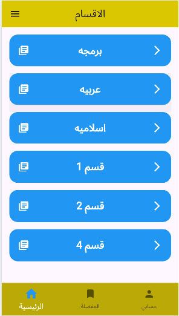
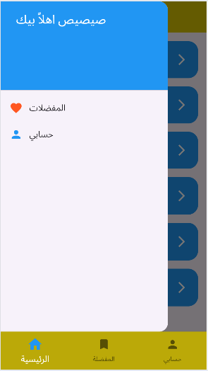
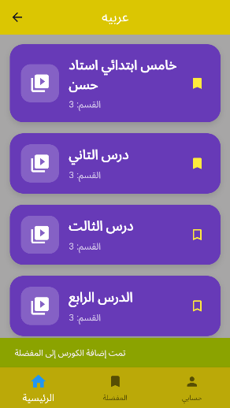
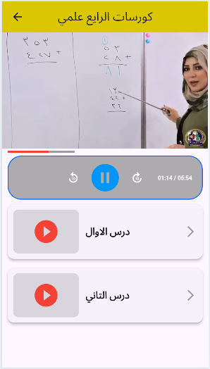
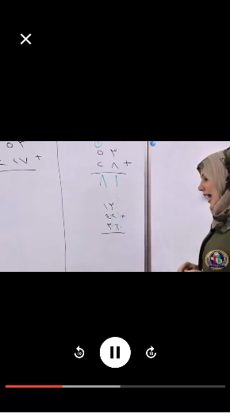
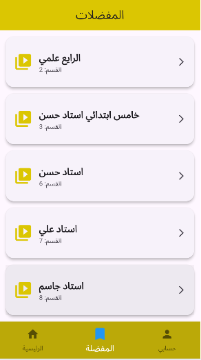
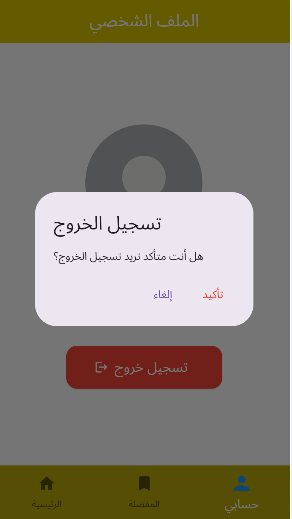

# منصة تعليمية - Flutter Application

## نبذة عن المشروع

تطبيق تعليمي تم تطويره باستخدام Flutter ويرتبط مع Laravel API لعرض الأقسام والكورسات والفيديوهات التعليمية.

يوفر التطبيق واجهتين رئيسيتين:

* واجهة المستخدم (User).
* واجهة الإدارة (Admin).

---

# واجهة المستخدم (User)

تتيح للمستخدم الوصول إلى المحتوى التعليمي بسهولة من خلال:

* تسجيل الدخول وإنشاء حساب.
* استعراض الأقسام التعليمية.
* عرض الكورسات داخل كل قسم.
* مشاهدة الفيديوهات التعليمية.
* إضافة الكورسات إلى المفضلة.
* إدارة الملف الشخصي.
<h2>صور واجهة المستخدم</h2>

<table>
  <tr>
    <td align="center">
      <b>الصفحة الرئيسية</b> 
      
    </td>
    <td align="center">
      <b>المينيو</b> 
      
    </td>
  </tr>

  <tr>
    <td align="center">
      <b>صفحة الكورسات</b> 
      
    </td>
    <td align="center">
      <b>صفحة الفيديوهات</b> 
      
    </td>
  </tr>

  <tr>
    <td align="center">
      <b>داخل الفيديو</b> 
      
    </td>
    <td align="center">
      <b>المفضلة</b> 
      
    </td>
  </tr>

  <tr>
    <td colspan="2" align="center">
      <b>الملف الشخصي</b> 
      
    </td>
  </tr>
</table>

# واجهة الإدارة (Admin)

تمكن المسؤول من إدارة محتوى المنصة التعليمية بالكامل.

### إدارة الأقسام

* إضافة قسم جديد.
* تعديل الأقسام.
* حذف الأقسام.

### إدارة الكورسات

* إضافة كورسات جديدة.
* تعديل بيانات الكورسات.
* حذف الكورسات.

### إدارة الفيديوهات

* إضافة فيديوهات.
* تعديل الفيديوهات.
* حذف الفيديوهات.

### إدارة المستخدمين

* عرض جميع المستخدمين.
* حذف المستخدمين.
* متابعة نشاط المستخدمين.

## صور لوحة الإدارة

### الصفحة الرئيسية

### إدارة الأقسام

### إدارة الكورسات

### إدارة الفيديوهات

### إدارة المستخدمين

### الملف الشخصي للإدارة

---

# التقنيات المستخدمة

## Frontend

* Flutter
* Dart

## Backend

* Laravel
* PHP
* MySQL
* REST API

---

# المطور

**علي عباس**
